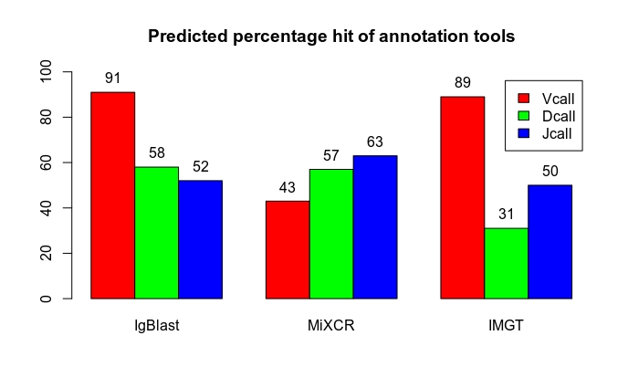
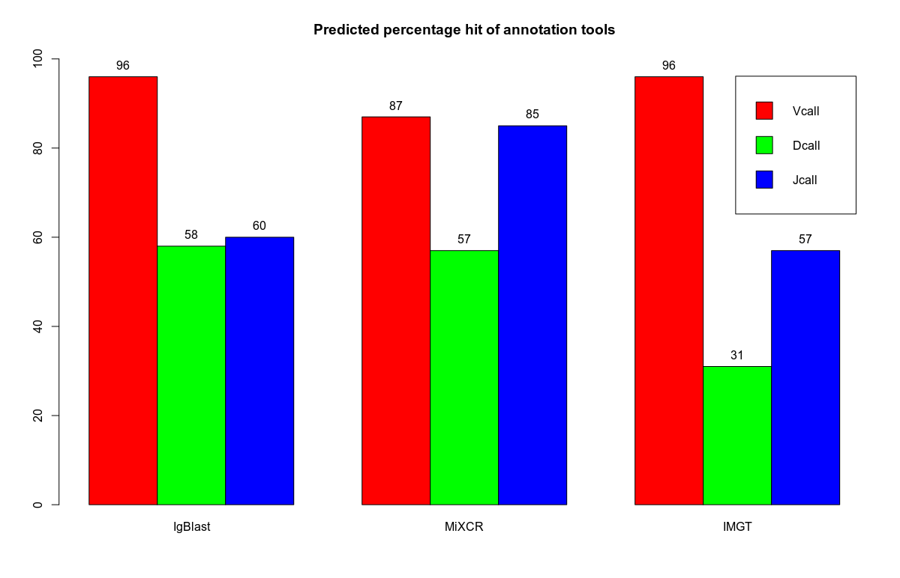

## Analysis Report 

**Step 1: Simulation of bovine antibody repertoire**

Igsimulator version 2.0 (Safonova, Lapidus, & Lill, n.d.) was used to simulate bovine antibody repertoires for benchmarking annotation tools since there is no gold standard dataset needed to validate these annotation tools. To get datasets of two different diversities for comparison. 
We simulated both diverse/naive antibody repertoire(generating a high number of low abundant clusters of mutated sequences) and polarized/class-switched antibody repertoire(generating a high number of repetitive clusters). Parameters used to generate these
repertoires, for diverse antibody repertoire the number of base antibody was set as 100000 and the number of mutated antibody 200000.
For the class-switched antibody repertoire, the number of base antibody was set as 20000 and mutated antibody 100000 (Smakaj et al., 2019)⁠.
The resultant output for Igsimulator that is important for this benchmarking analysis;
 - Illumina paired-end reads that were generated by ART Version 2.1.8, a next-generation read simulator (Huang, Li, Myers, & Marth, 2012). 
 - The merged file that is a result of merging read 1 and read 2 
 - read recombination file that contains all the information about V(D)J recombination for each reads from the merged file 
Igsimulator uses IMGT germline reference as an input having IMGT header numbering system. 

**Step 2 : Annotation of simulated datasets**

Three annotation immunoinformatic tools were used in this analysis i.e. IMGT, IgBlast and MiXCR. The analysis was performed using MiXCR version 3.0.10, Igblast version 1.15.0 and IMGT/High V-QUEST which is an online annotation platform. 

NB: _commands for IgBlast and IgBlast are provided in the `command.md` file. Snakemake file was generated for MiXCR workflow_

**Step 3 : Comparison of annotation outputs**

Analysis at this step was done using R program version 3.6.2 and the script is provided in this repository. This was done both at the allelic level and gene level. To be fair to MiXCR annotation, an analysis was done at the gene level and was considered compariable because MiXCR does annotation at gene level as compared to IgBlast and IMGT that identifies V, D and J genes and alleles by alignment with the germline receptor genes and alleles sequences of germline database provided. We could see a lot of improvement in the accuracy of MiXCR at gene level as compared to the allele level comparison.  At allele level, MiXCR annotates the V gene with a predicted accuracy of 43% whereas at the gene level it had a predicted accuracy of 87% for the same gene. IgBlast and MiXCR had a slight increase of from 90% to 96% predicted accuracy. 

Below are the two comparison steps. 

**Comparison - Allele level**

**Comparison - Gene level** 

Challenges for this step th

