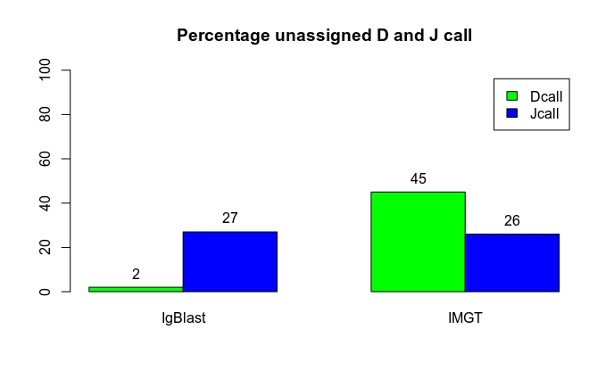

## Analysis Report 

**Step 1: Simulation of bovine antibody repertoire**

Igsimulator version 2.0 (Safonova, Lapidus, & Lill, n.d.) was used to simulate bovine antibody repertoires for benchmarking annotation tools since there is no gold standard dataset needed to validate these annotation tools. To generate datasets of two different diversities for comparison. 
We simulated both diverse/naive antibody repertoire(generating a high number of low abundant clusters of mutated sequences) and polarized/class-switched antibody repertoire(generating a high number of repetitive clusters). Parameters used to generate these
repertoires, for diverse antibody repertoire the number of base antibody was set as 100000 and the number of mutated antibody 200000.
For the class-switched antibody repertoire, the number of base antibody was set as 20000 and mutated antibody 100000 (Smakaj et al., 2019)⁠.
The resultant output for Igsimulator that were used for this benchmarking analysis;
 - Illumina paired-end reads that were generated by ART Version 2.1.8, a next-generation read simulator (Huang, Li, Myers, & Marth, 2012). 
 - The merged file that is a result of merging read 1 and read 2 
 - Read recombination file that contains all the information about V(D)J recombination for each reads from the merged file 
Igsimulator uses IMGT germline reference as an input having IMGT header numbering system. 

**Step 2 : Annotation of simulated datasets**

Three annotation immunoinformatic tools were used in this analysis i.e. IMGT, IgBlast and MiXCR. The analysis was performed using MiXCR version 3.0.10, Igblast version 1.15.0 and IMGT/High V-QUEST which is an online annotation platform. 

NB: _commands for IgBlast and IgBlast are provided in the `command.md` file. Snakemake file was generated for MiXCR workflow_

**Step 3 : Comparison of annotation outputs**

Analysis at this step was done using R program version 3.6.2 and the script is provided in this repository. This was done both at the allelic level and gene level. To be fair to MiXCR annotation, analysis done at the gene level and was considered compariable because MiXCR does annotation at gene level as compared to IgBlast and IMGT that identifies V, D and J genes and alleles by alignment with the germline receptor genes and alleles sequences of germline database provided. We could see a lot of improvement in the accuracy of MiXCR at gene level as compared to the allele level comparison.  At allele level, MiXCR annotates the V alleles with a predicted accuracy of 43% whereas at the gene level it had a predicted accuracy of 87%. IgBlast and MiXCR had a slight increase of from 90% to 96% predicted accuracy. Overall for the V gene, MiXCR had a slightly higher number of predicted mishit of 13% compared to IgBlast and IMGT which had a 4% predicted error rate for V gene calls. IMGT had the highest percentage of mishit of 69% for the D gene and this was as a result of 45% unassigned D gene calls. MiXCR had the lowest percentage of J gene call error rate of 15% compared to Igblast 40% and IMGT 43% error rates(diverse antobody repertoire). This analysis was comparable to polarized antibody repertoire and we could see relatively similar predicted percentages of hits and mishits.  

Below are the two comparison steps. 

**Comparison - Allele level**

**Comparison - Gene level** 

**Challenges**

The challenge for this step of comparison is that we do not have a unique denominator when calculating predicted accuracy and error rates. The denominator for Igblast and IMGT is the same but MiXCR is different. Annotation using MiXCR does not align 100% of the reads, it aligns 65% of the reads and this is because there is an overlap. This is the reason why we are seeing a difference in the denominator for MiXCR. Because this was a challenge for our analysis. We had to use a different denominator for MiXCR and because we were comparing hit and mishits, calculations were done based on whether there was a match or a mismatch for each antibody generated for MiXCR annotation. 33% of the misaligned reads are as a result of the absence of J hits.
For IgBlast and IMGT annotation outputs, we could see some percentage of unassigned D and J gene calls. The graph below shows the frequencies of unassigned genes. Q: Why is this happening ? 

**Overcoming  the denominator challenge**

MiXCR aligns D genes only after V/J junction position is determined, and hence if there is no J gene, MiXCR can't produce successful alignment here. This is because the sequence has no complete CDR3 sequences and MiXCR tends to drop the sequences. For this reason, we see a 35% unaligned sequence reads. 
To get all reads aligned, this parameter of MiXCR needs to be overidden. We add  `-OallowPartialAlignments=true - OallowNoCDR3PartAlignments=true` this parameter to align command and we get a 98% alignment. Unfortunately, now we see unassigned D & J gene calls in MiXCR. MiXCR will not only call V genes at this point and not the D gene and J gene.  The alignment of the D gene is detrimental to assigning J genes. Deep understanding is needed to try to validate whether MiXCR can assign J gene without D gene call.  

After adjustment of MiXCR we get below graphs of comparison; 

(upload hit, mishit and unassigned barplots)

**Step 4 : Distribution of genes by the three annotation tools**
